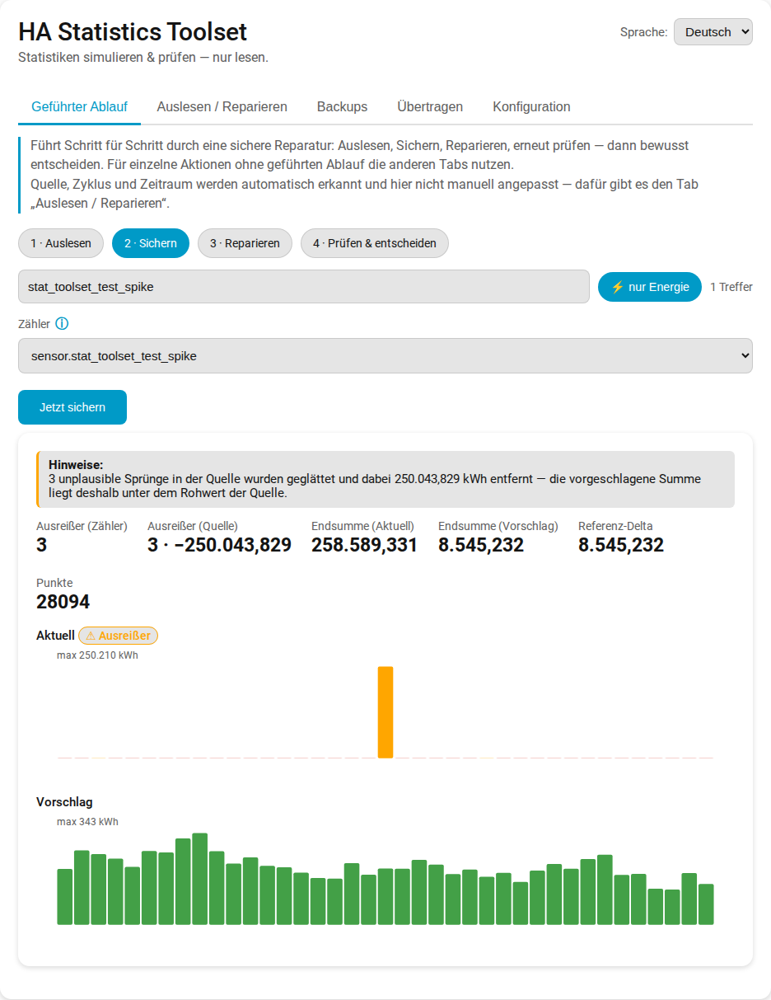
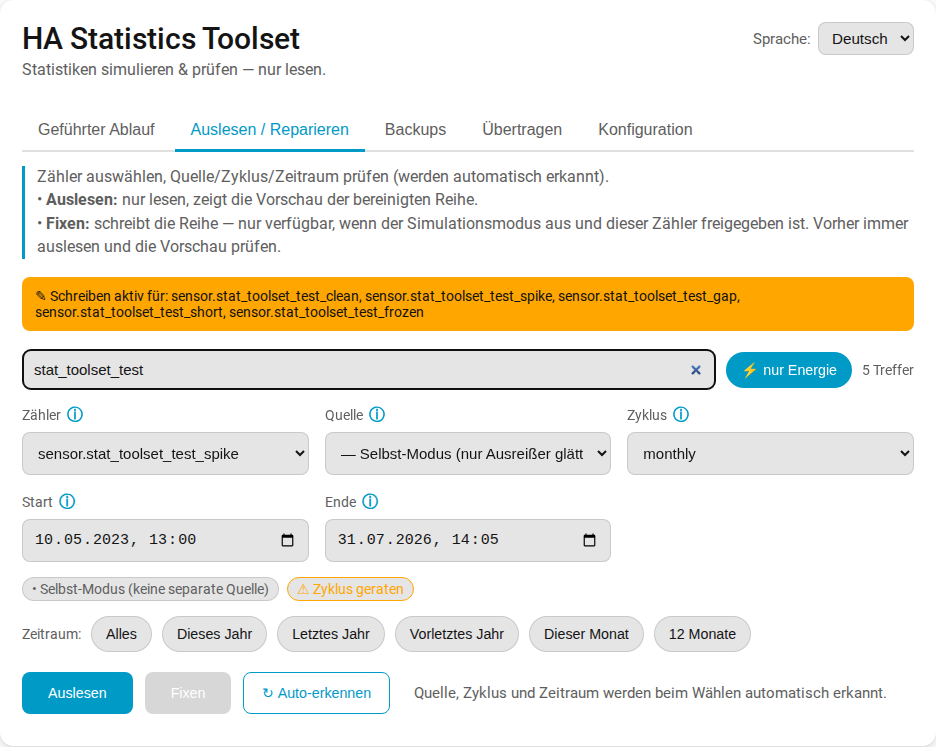
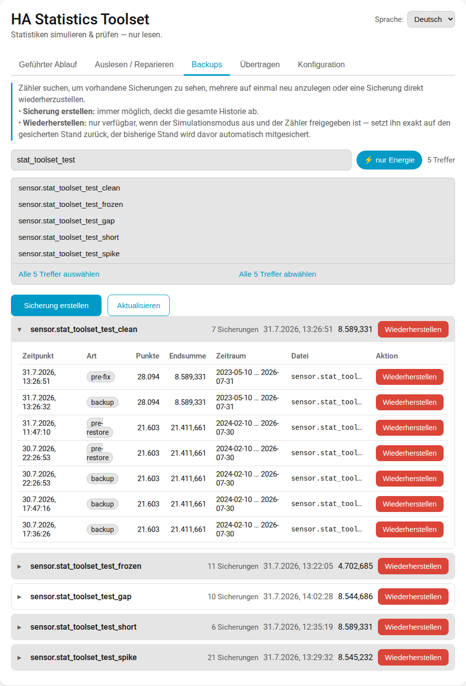
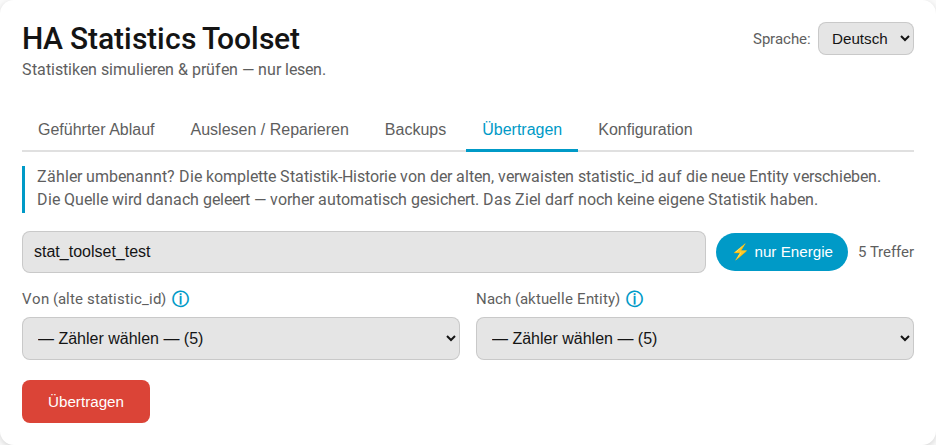
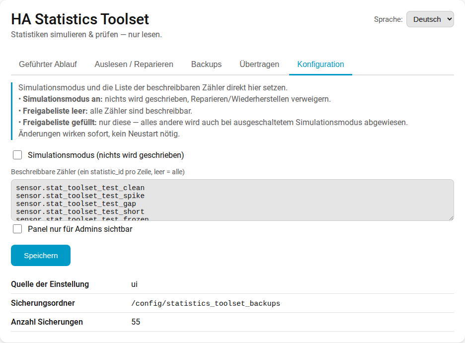
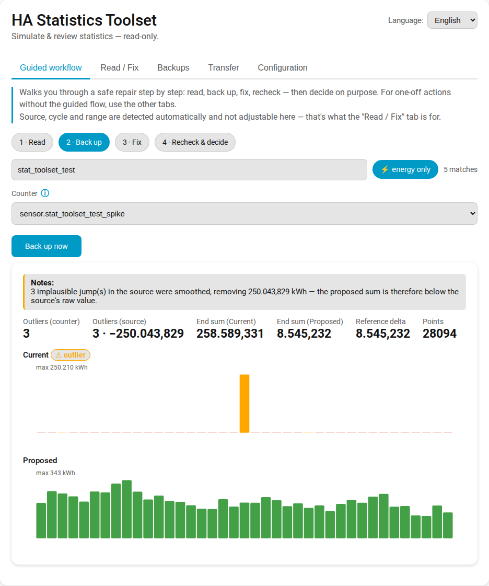
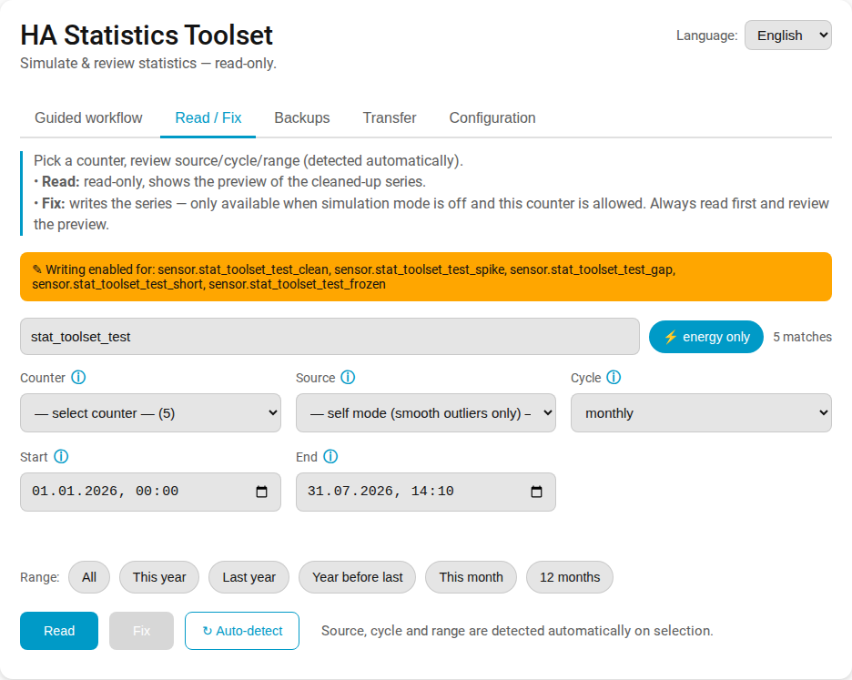
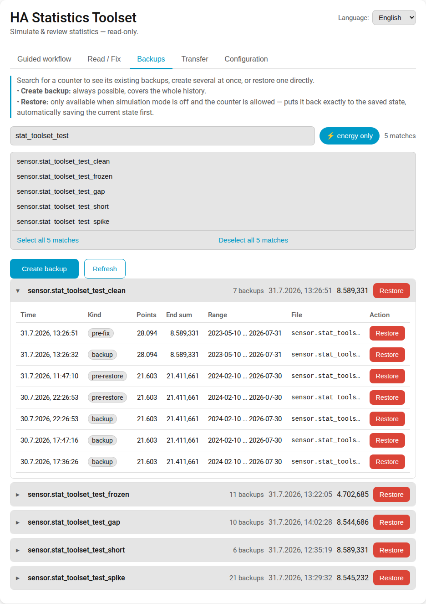
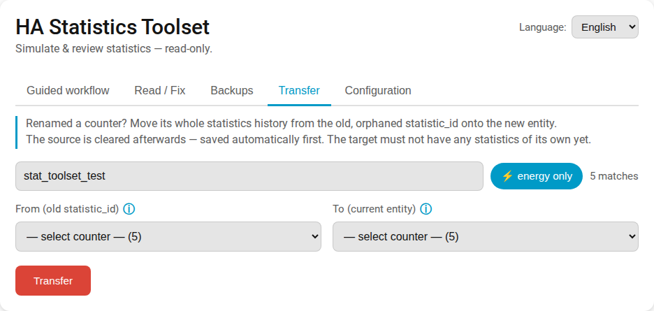
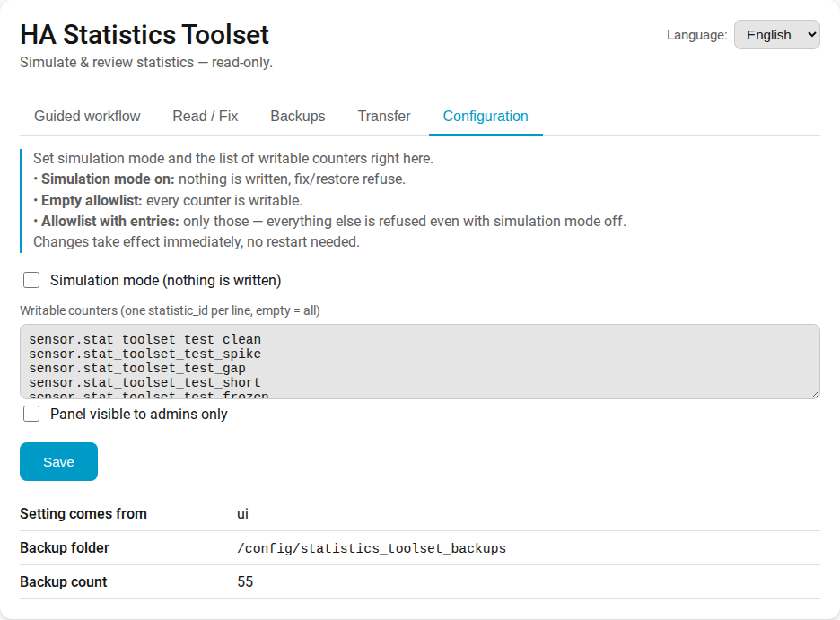

# HA Statistics Toolset

**Kaputte Home-Assistant-Statistiken, richtig repariert:** erkennen, Vorschau, sichern,
reparieren — alles aus einem einzigen Sidebar-Panel. Trifft die Ausreißer und
„unmöglichen" Spitzen, die das Energie-Dashboard und History-Graphen kaputt machen, und
schreibt ausschließlich über die offiziellen Recorder-APIs.

<p align="center">
  <a href="https://my.home-assistant.io/redirect/hacs_repository/?owner=turbolooser&repository=ha-statistics-toolset&category=integration">
    
  </a>
</p>

**[🇩🇪 Deutsch](#deutsch) · [🇬🇧 English](#english)**

---

## Deutsch

Baut aus *einer* vertrauenswürdigen Quelle eine saubere, monotone Reihe für jeden Zähler und
**jeden `utility_meter`-Zyklus** neu auf — Zähler auswählen genügt, Quelle, Zyklus und
Zeitraum werden automatisch erkannt. Ohne passende Quelle glättet der **Selbst-Modus**
stattdessen nur die eigenen Ausreißer des Zählers.

### Screenshots

<p align="center">
  
  
</p>
<p align="center">
  
  
</p>
<p align="center">
  
</p>

### ℹ️ Über dieses Projekt

Ich bin **kein professioneller Softwareentwickler** — diese Integration wird **mit Hilfe
von KI** entworfen und geschrieben, aus dem echten Bedarf heraus, meine eigenen
Home-Assistant-Statistiken zu reparieren. Genau deshalb sind die Sicherheitsmechanismen so
wichtig: vollständige Backups behalten, den Code vor dem Ausführen lesen und immer erst
`Simulieren` vor `Reparieren` nutzen. Rückmeldungen und Pull Requests von erfahrenen
Entwicklern sind sehr willkommen.

### ⚠️ WARNUNG VOR DATENVERLUST — ZUERST LESEN

**Diese Integration kann in die Statistik-Datenbank von Home Assistant schreiben. Falsch
eingesetzt kann sie historische Daten dauerhaft beschädigen oder löschen.**

- **Nutzung vollständig auf eigenes Risiko.** Keinerlei Gewährleistung (siehe [LICENSE](LICENSE)).
- **Vor jedem `Reparieren`/`Wiederherstellen` immer ein vollständiges Home-Assistant-Backup
  anlegen.** Das Tool schreibt zusätzlich eine JSON-Sicherung der betroffenen Reihe, aber
  ein vollständiges Backup ist dein eigentliches Sicherheitsnetz.
- Jede Reparatur ist zweistufig: **erst `Simulieren` (nur lesen, Vorschau), `Reparieren`
  erst, nachdem du die Zahlen selbst geprüft hast.** Keine stille Auto-Reparatur.
- **Read-only-Modus:** Standardmäßig ist `READ_ONLY_MODE = True` (in `const.py`) — dann sind
  **alle Schreibpfade gesperrt** (`Reparieren`/`Wiederherstellen` verweigern), nur
  `Simulieren` und `Backup` laufen. Ideal zum Testen.

Wenn du dich nicht wohl damit fühlst, die Vorschau zu prüfen und die Zahlen selbst zu
bestätigen: **nutze dieses Tool nicht.**

### Was es kann

| Service | Schreibt? | Status |
|---|---|---|
| `detect` — Quelle, Zyklus, Zeitraum und Ausreißer-Schwelle automatisch vorschlagen | nein | ✅ seit v0.4 |
| `simulate` — Zähler scannen, Ausreißer + korrigierte Reihe als Vorschau (nur lesen) | nein | ✅ |
| `backup` — mit Zeitstempel versehene JSON-Sicherung (wiederholbar) | nein* | ✅ |
| `fix` — korrigierte Reihe über offizielle Recorder-APIs schreiben (mit Backup) | ja | 🧪 im Read-only-Modus gesperrt |
| `restore` — Zählerstatistik aus einer JSON-Sicherung wiederherstellen | ja | 🧪 im Read-only-Modus gesperrt |
| `transfer` — Statistik-Historie auf eine umbenannte Entity übertragen | ja | 🧪 im Read-only-Modus gesperrt |

\* `backup` schreibt nur eine JSON-Datei, nie in die Statistik-Datenbank.

Alle Schreibzugriffe laufen über die **offiziellen** Recorder-APIs
(`recorder/import_statistics`) — **keine direkten SQLite-Schreibzugriffe.**

### Wie die Mechanik funktioniert

Es gibt genau **eine Wahrheit**: den kumulativen Verbrauch einer langlaufenden Quelle
(z. B. ein Riemann-`integration`-Sensor). Jeder Zähler wird daraus abgeleitet:

```
sum[t]   = quelle[t] − quelle[reihenstart]          # kumulativ, für alle Zyklen gleich
state[t] = quelle[t] − quelle[letzter_reset(t)]     # Sägezahn, Reset-Regel je Typ
```

Nur die **Reset-Regel** unterscheidet die Zählertypen — unterstützt werden **alle**
`utility_meter`-Zyklen: `yearly` (1. Jan) · `quarterly` (Jan/Apr/Jul/Okt) · `bimonthly`
(Jan/Mär/Mai/…) · `monthly` (Monatserster) · `weekly` (Montag 00:00) · `daily` (Mitternacht) ·
`hourly` (Minute 0) · `quarter-hourly` (0/15/30/45) · `none` (permanenter Zähler ohne Reset).
Die Regeln entsprechen den Cron-Mustern, die `utility_meter` selbst verwendet, und werden
**DST-korrekt** in der lokalen Zeitzone berechnet. Ausreißer werden mit einer **Offset-Methode** entfernt (den
Phantom-Sprung einmalig von allen Folgewerten abziehen), nie kaskadierend. Ein eingebauter
Plausibilitäts-Check prüft `Endsumme == Quell-Delta`, bevor irgendetwas geschrieben wird.

**Zwei Modi:**

| Modus | Quelle | Was passiert |
|---|---|---|
| **Rekonstruktion** | ein vertrauenswürdiger Sensor | die Reihe wird vollständig neu aufgebaut — der Zyklus wird konsistent zur Quelle |
| **Selbst-Modus** | leer | der Zähler ist seine eigene Quelle: nur seine Ausreißer werden geglättet, der Rest der Historie bleibt unangetastet |

**Automatische Erkennung** (`detect`, nur lesen): Der **Zyklus wird exakt aus der
`utility_meter`-Konfiguration gelesen** (nur wenn das nicht geht, wird er am Entity-Namen
geraten — `detect` sagt in `cycle_via`, was zutrifft, und das Panel warnt beim Raten). Der
Zeitraum kommt aus den vorhandenen Statistik-Daten. Die **Quelle** wird über vier Wege gesucht, vom zuverlässigsten
abwärts:

1. **Config-Entry** — über die UI angelegte Helfer (`utility_meter`, `integration`).
2. **`utility_meter`-Laufzeitdaten** — der Fall, den nur so lösbar ist: per **YAML/Package**
   konfigurierte Zähler haben keinen Config-Entry, ihre `source:` steht aber zur Laufzeit in
   `hass.data`.
3. **State-Attribut** — Riemann-`integration`-Sensoren veröffentlichen ihre Quelle selbst.
4. **Entity-Objekt** — letzter Ausweg über die laufende Entität.

**Mehrstufige Zähler:** Ist die Quelle selbst abgeleitet (`…_monthly` → permanenter
Gesamtzähler → Riemann-Integralsensor), wird die Kette **nach oben verfolgt** und die
**Wurzel** vorgeschlagen — sie ist am wenigsten abgeleitet, hat oft die längere Historie und
erbt keinen Defekt der Zwischenstufen. Verfolgt wird nur, solange die nächste Stufe
kumulative Werte hat; bei einem Mittelwert-Sensor (Leistung in W) endet die Kette. Die
vollständige Kette steht in `source_chain`, das Panel zeigt sie an.

Wird eine Quelle gefunden, die selbst **keine** Langzeitstatistik hat, wird sie verworfen
(sie wäre als Referenz nutzlos) und auf den Selbst-Modus zurückgefallen; beginnt sie später
als der Zähler, wird der Start entsprechend nachgezogen. `detect` gibt in `source_via` an,
über welchen Weg die Quelle gefunden — oder warum sie verworfen — wurde. Die **Ausreißer-Schwelle** kommt nicht mehr aus einem geratenen
Festwert, sondern aus der Median-Stundenrate der Daten selbst (× großzügigem Faktor, mit
Untergrenze) — deshalb ist das Feld aus der Oberfläche verschwunden.

### Installation

**Ein Klick:** Den Button oben nutzen, oder in HACS → ⋮ → **Benutzerdefinierte
Repositories** → `https://github.com/turbolooser/ha-statistics-toolset` als Kategorie
**Integration** hinzufügen → installieren → Home Assistant neu starten.

**Manuell:** `custom_components/statistics_toolset/` nach `config/custom_components/`
kopieren und neu starten.

### Konfiguration (optional)

Die Schreibsperren gehören **nicht** in den Code: eine Änderung an `const.py` ist beim
nächsten HACS-Update wieder weg. Stattdessen in `configuration.yaml` (oder einem Package):

```yaml
statistics_toolset:
  read_only: false          # Standard: true — alle Schreibpfade gesperrt
  write_allowlist:          # leer/fehlend = keine Einschränkung
    - sensor.mein_testzaehler
```

Beide Schlüssel sind optional; fehlen sie, gelten die sicheren Vorgaben aus `const.py`
(`read_only: true`). Ist `write_allowlist` gefüllt, sind **nur** diese `statistic_id`s
schreib- und löschbar — jeder andere Zähler wird auch mit `read_only: false` und
`confirm: true` abgewiesen. Genau so testet man an einem Zähler, während die echten Daten
technisch unerreichbar bleiben. Änderungen greifen nach einem Neustart von Home Assistant.

### Nutzung

> Zuerst ein vollständiges Backup. Dann `Simulieren`, die Vorschau prüfen, und erst dann
> `Reparieren`.

**Über das Panel** (Seitenleiste → *HA Statistics Toolset*, standardmäßig nur Admin —
umschaltbar im Config-Tab):

1. **Geführter Ablauf:** Zähler wählen und Schritt für Schritt durch Auslesen → Sichern →
   Reparieren → erneut prüfen gehen, am Ende bewusst `Behalten` oder `Zurück auf
   Sicherung` wählen. Quelle/Zyklus/Zeitraum werden automatisch erkannt und sind hier
   nicht editierbar — genau das macht den Ablauf geführt statt manuell.
2. **Auslesen/Reparieren:** derselbe Zugriff manuell statt geführt — Zähler auswählen
   (Liste filterbar, `*` als Platzhalter, auf Energie-Sensoren beschränkbar), Quelle/
   Zyklus/Zeitraum füllen sich automatisch und sind hier überschreibbar. `Auslesen` zeigt
   Kennzahlen und zwei Balkengrafiken (aktuell/bereinigt) als Vorschau, `Fixen` schreibt
   sie — nur verfügbar, wenn der Simulationsmodus aus und der Zähler freigegeben ist.
3. **Backups:** Zähler suchen, mehrere auf einmal sichern, vorhandene Sicherungen nach
   Zähler gruppiert einsehen und direkt wiederherstellen.
4. **Übertragen:** die komplette Historie eines umbenannten Zählers von der alten,
   verwaisten `statistic_id` auf die neue Entity verschieben.
5. **Konfiguration:** Simulationsmodus, Freigabeliste und Panel-Sichtbarkeit direkt hier
   setzen, ohne Neustart.

**Über die Services:** alle unter der Domain `statistics_toolset.*` (siehe `services.yaml`).
`detect` liefert die Vorschläge als Service-Response, `backup` legt jederzeit wiederholbar
eine Sicherung mit Zeitstempel an (unter `config/statistics_toolset_backups/`); `restore`
stellt daraus wieder her. Wurde eine Entity umbenannt, verschiebt `transfer` deren
komplette Historie von der alten, verwaisten `statistic_id` auf die neue Entity (auch direkt
im eigenen „Übertragen"-Tab des Panels) — die alte ID wird danach geleert, das Ziel muss
noch leer sein.

### Roadmap

- ✅ **Dashboard-Panel** in der Seitenleiste: Simulation + Vorher/Nachher-Graph, Sprache
  folgt Home Assistant (Auto/DE/EN).
- ✅ **Automatische Erkennung**: Quelle, Zyklus, Zeitraum und Ausreißer-Schwelle werden
  erkannt statt eingetippt; Quelle optional (Selbst-Modus).
- ✅ **Backup/Restore direkt im Panel**, mit mehrstufiger Bestätigung, Mehrfachauswahl
  und nach Zähler gruppierter, aufklappbarer Übersicht.
- ✅ **Panel-Sichtbarkeit umschaltbar** (admin-only oder für alle Nutzer), Config-Tab
  direkt im Panel.
- ✅ **`transfer`** — Statistik-Historie von einer verwaisten `statistic_id` auf eine
  umbenannte Entity übertragen.
- Konsistenz-Cross-Check gegen einen zweiten Referenzsensor.

### Mitwirken

Issues und PRs willkommen. Die Mechanik liegt in `engine/` und ist bewusst
Home-Assistant-unabhängig (unit-testbar); der HA-Anschluss liegt in `recorder_io.py` und
`coordinator.py`.

### Änderungen

Alle Versionen mit ihren Änderungen stehen im [CHANGELOG](CHANGELOG.md); jede Version hat ein
[GitHub-Release](https://github.com/turbolooser/ha-statistics-toolset/releases) — nur darüber
sieht HACS ein Update.

### Lizenz

[MIT](LICENSE) — bereitgestellt „wie besehen", ohne jegliche Gewährleistung.

---

## English

Detects and repairs **corrupted long-term statistics** of Home Assistant counters — the
outliers and "impossible" spikes that break the Energy Dashboard and history graphs.
Sidebar panel to review, back up and restore; everything goes through the official
recorder APIs.

It rebuilds a clean, monotonic series for any counter and **any `utility_meter` cycle** from
a single trusted source — just pick a counter, source/cycle/range are detected
automatically. Without a suitable source, **self mode** smooths only the counter's own
outliers instead.

### Screenshots

<p align="center">
  
  
</p>
<p align="center">
  
  
</p>
<p align="center">
  
</p>

### ℹ️ About this project

I'm **not a professional software developer** — this integration is designed and written
**with the help of AI**, out of a real need to repair my own Home Assistant statistics.
That's exactly why the safety rails matter: keep full backups, read the code before you run
it, and always use `simulate` before `fix`. Feedback and pull requests from experienced
developers are very welcome.

### ⚠️ DATA-LOSS WARNING — READ THIS FIRST

**This integration can write to your Home Assistant statistics database. Used incorrectly
it can permanently corrupt or delete historical data.**

- **You use it entirely at your own risk.** No warranty of any kind (see [LICENSE](LICENSE)).
- **Always take a full Home Assistant backup before any `fix`/`restore`.** The tool also
  writes a JSON snapshot of the affected series, but a full backup is your real safety net.
- Every repair is two-step: **`simulate` (read-only preview) first, `fix` only after you
  have reviewed the numbers.** No silent auto-repair.
- **Read-only mode:** `READ_ONLY_MODE = True` by default (in `const.py`) disables **all
  write paths** (`fix`/`restore` refuse); only `simulate` and `backup` run. Ideal for testing.

If you are not comfortable reviewing the preview and confirming the numbers yourself,
**do not use this tool.**

### What it does

| Service | Writes? | Status |
|---|---|---|
| `detect` — suggest source, cycle, range and outlier threshold automatically | no | ✅ since v0.4 |
| `simulate` — scan a counter, preview outliers + corrected series (read-only) | no | ✅ |
| `backup` — timestamped JSON snapshot (repeatable) | no* | ✅ |
| `fix` — write the corrected series via official recorder APIs (with backup) | yes | 🧪 blocked in read-only mode |
| `restore` — restore a counter's statistics from a JSON backup | yes | 🧪 blocked in read-only mode |
| `transfer` — move statistics history onto a renamed entity | yes | 🧪 blocked in read-only mode |

\* `backup` only writes a JSON file, never to the statistics database.

All writes go through the **official** recorder APIs (`recorder/import_statistics`) —
**no direct SQLite writes.**

### How the mechanic works

There is exactly **one truth**: the cumulative consumption of a long-running source
(e.g. a Riemann `integration` sensor). Every counter is derived from it:

```
sum[t]   = source[t] − source[series_start]          # cumulative, same for all cycles
state[t] = source[t] − source[last_cycle_reset(t)]   # saw-tooth, reset rule per type
```

Only the **reset rule** differs between counter types (`yearly` → Jan 1 · `monthly` → 1st
of month · `weekly` → Monday 00:00 · `daily` → midnight), computed **DST-correctly** in the
local timezone. Outliers are removed with an **offset method** (subtract the phantom jump
once from all following values), never cascading. A built-in plausibility check asserts
`end_sum == source_delta` before anything is written.

**Two modes:**

| Mode | Source | What happens |
|---|---|---|
| **Reconstruction** | a trusted sensor | the series is fully rebuilt — the cycle becomes consistent with the source |
| **Self mode** | empty | the counter is its own source: only its outliers are smoothed, the rest of the history is left untouched |

**Auto-detection** (`detect`, read-only): the **cycle is read straight from the
`utility_meter` configuration** (only if that fails is it guessed from the entity name —
`detect` states which in `cycle_via`, and the panel warns when guessing). The range comes
from the available statistics. The **source** is resolved through four strategies, most
reliable first:

1. **Config entry** — helpers created via the UI (`utility_meter`, `integration`).
2. **`utility_meter` runtime data** — the only way to resolve **YAML/package**-configured
   meters, which have no config entry but do expose their `source:` in `hass.data`.
3. **State attribute** — Riemann `integration` sensors publish their source themselves.
4. **Entity object** — last resort, via the live entity.

**Multi-stage counters:** if the source is itself derived (`…_monthly` → a permanent total →
a Riemann integration sensor), the chain is **followed upstream** and the **root** is
proposed — it is the least derived, often has the longer history, and inherits no defect from
the intermediate stages. Following stops as soon as a stage has no cumulative values, e.g. at
a mean-only power sensor. The full chain is returned in `source_chain` and shown in the panel.

If the resolved source has **no** long-term statistics of its own it is discarded (it would
be useless as a reference) and self mode is used instead; if it starts later than the
counter, the range start is moved up accordingly. `detect` reports in `source_via` which
strategy won — or why the source was discarded. The **outlier threshold** is no longer a guessed constant but derived from the
median hourly rate of the data itself (times a generous factor, with a floor) — which is why
that field has disappeared from the UI.

### Installation

**One click:** use the badge at the top, or in HACS → ⋮ → **Custom repositories** → add
`https://github.com/turbolooser/ha-statistics-toolset` as category **Integration** →
install → restart Home Assistant.

**Manual:** copy `custom_components/statistics_toolset/` into `config/custom_components/`
and restart.

### Configuration (optional)

The write locks do **not** belong in the code: editing `const.py` is undone by the next HACS
update. Use `configuration.yaml` (or a package) instead:

```yaml
statistics_toolset:
  read_only: false          # default: true — every write path is blocked
  write_allowlist:          # empty/absent = no restriction
    - sensor.my_test_counter
```

Both keys are optional; without them the safe defaults from `const.py` apply
(`read_only: true`). With a non-empty `write_allowlist`, **only** those `statistic_id`s can be
written or cleared — any other counter is refused even with `read_only: false` and
`confirm: true`. That is how you exercise the write paths on one counter while real data stays
technically unreachable. Changes take effect after restarting Home Assistant.

### Usage

> Take a full backup first. Then `simulate`, review the preview, and only then `fix`.

**Via the panel** (sidebar → *HA Statistics Toolset*, admin-only by default — switchable in
the config tab):

1. **Guided workflow:** pick a counter and step through Read → Back up → Fix → recheck,
   then deliberately choose `Keep` or `Roll back to backup`. Source/cycle/range are
   detected automatically and not editable here — that is what makes it guided rather
   than manual.
2. **Read/Fix:** the same access, manual instead of guided — pick a counter (list
   filterable, `*` as wildcard, limitable to energy sensors), source/cycle/range fill in
   automatically and are overridable here. `Read` previews key figures and two bar charts
   (current/clean), `Fix` writes them — only available when simulation mode is off and the
   counter is allowed.
3. **Backups:** search for a counter, back up several at once, view existing backups
   grouped by counter and restore directly.
4. **Transfer:** move a renamed counter's whole history from its old, orphaned
   `statistic_id` onto the new entity.
5. **Configuration:** set simulation mode, the write allowlist and panel visibility right
   here, no restart needed.

**Via the services:** all under the `statistics_toolset.*` domain (see `services.yaml`).
`detect` returns its suggestions as a service response, `backup` writes a timestamped
snapshot any time (repeatable, into `config/statistics_toolset_backups/`); `restore` restores
from it. If an entity got renamed, `transfer` moves its whole history from the old,
orphaned `statistic_id` onto the new entity (also available right in the panel's own Transfer
tab) — the old id is cleared afterwards, and the target must still be empty.

### Roadmap

- ✅ **Dashboard panel** in the sidebar: simulation + before/after graph, language follows
  Home Assistant (Auto/DE/EN).
- ✅ **Auto-detection**: source, cycle, range and outlier threshold are detected instead of
  typed; source is optional (self mode).
- ✅ **Backup/restore right in the panel**, with multi-step confirmation, multi-select, and
  a per-counter grouped, collapsible history.
- ✅ **Panel visibility switch** (admin-only or everyone), configuration tab in the panel.
- ✅ **`transfer`** — move statistics history from an orphaned `statistic_id` onto a
  renamed entity.
- Consistency cross-check against a second reference sensor.

### Contributing

Issues and PRs welcome. The mechanic lives in `engine/` and is intentionally
Home-Assistant-independent (unit-testable); the HA glue lives in `recorder_io.py` and
`coordinator.py`.

### Changes

Every version and its changes are listed in the [CHANGELOG](CHANGELOG.md); each version has a
[GitHub release](https://github.com/turbolooser/ha-statistics-toolset/releases) — HACS only
sees updates through those.

### License

[MIT](LICENSE) — provided "as is", without warranty of any kind.
